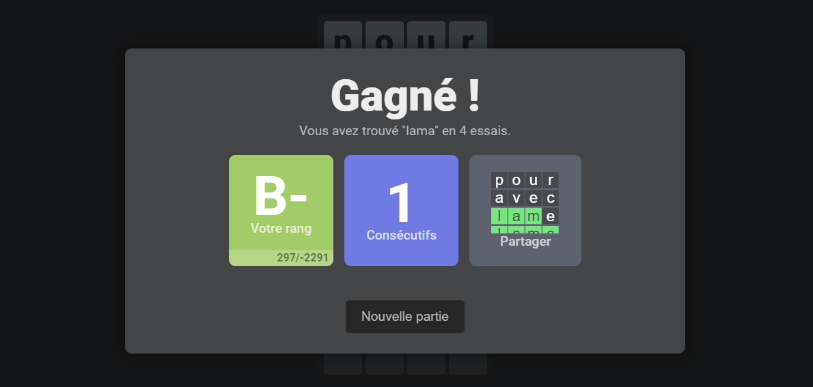
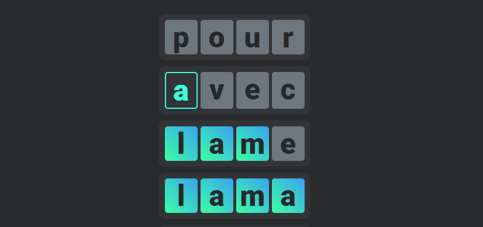

# Motus
Motus is a Wordle-like online app made with react and typescipt. It's still WIP, so there are bugs.

## Features


- Ranks (the more you play, the higher your rank gets and words get increasly longer).
- Custom word list, you can import your own custom .dic file, the default one is in french, with 900k words.
- An API to get words by lengh, check if word exists, and stats.
- Streaks.
- The UI is currently in french only, but it's pretty easy to translate.
- "Share" button that will generate a sharable image of your wordle.
- Not a feature, but this was made for a school project, that's why most values are in french.

## API
The API only has one endpoint:
```
GET /api/word
```
You can get a random word using the 'taille' parameter :
```
GET /api/word?taille=5
>> { 'mot': 'mange' }
```
Check if a word exists:
```
GET /api/word?type=check&mot=test
>> { 'exists': true }
```
The API needs time to cache the imported dictionnary the first time you use it after launching the app.

## Getting Started

First, run the development server:

```bash
npm run dev
# or
yarn dev
# or
pnpm dev
```

Open [http://localhost:3000](http://localhost:3000) with your browser to see the result.
